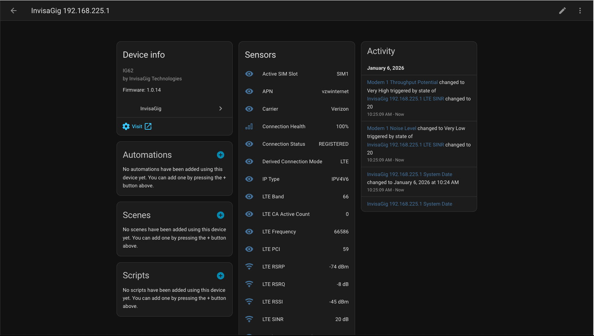
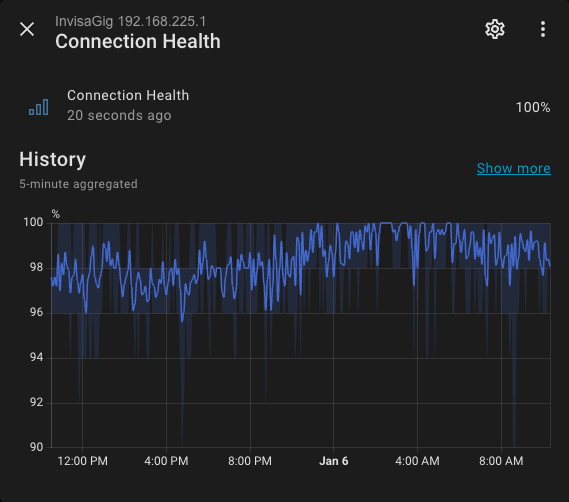
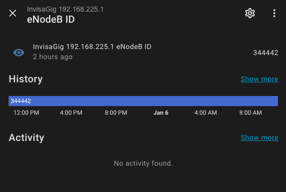

# InvisaGig Integration for Home Assistant

  

**Disclaimer:** This integration is a community project and is **NOT** affiliated with, endorsed by, or supported by InvisaGig, Wireless Haven, or any of their related companies. It is created by a user, for users, to extend the product's capabilities into the Home Assistant ecosystem.

## Features
Custom integration for InvisaGig cellular modems (IG62, etc).
Exposes telemetry fields as sensors for Home Assistant.

- **Telemetry Polling**: Updates every 60 seconds (hardware limit).
- **Sensors**: Signal strength, Bandwidth, Data usage, Temperature, and more.
- **Plug & Play**: Auto-discovery of model and settings.

## Installation

### HACS (Custom Repository)

1. Open HACS > Integrations.
2. Click the three dots in the top right corner > **Custom repositories**.
3. URL: `https://github.com/taylorsnow/ha-invisagig`
4. Category: **Integration**.
5. Click **Add**.
6. Search for "InvisaGig" and install.
7. Restart Home Assistant.
8. Go to **Settings > Devices & Services > Add Integration** and search for "InvisaGig".

### Manual

1. Copy the `custom_components/invisagig` folder to your `config/custom_components/` directory.
2. Restart Home Assistant.

## Configuration

### Required
- **Host**: The IP address or hostname of your InvisaGig modem (e.g., `192.168.225.1` or `invisagig`).

## Features

- **Telemetry Polling**: Updates every 60 seconds (hardware limit).
- **Sensors**: 
    - Signal strength (RSRP, RSRQ, SINR)
    - Bandwidth & Data usage
    - Temperature
    - Detailed Cellular Info (MCC, MNC, LAC/TAC, CID, eNodeB)
- **Auto-Discovery**: Automatically checks the default IP (192.168.225.1) during setup.

## License

MIT
